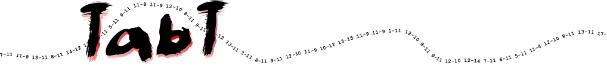

= Home
Gaëtan Frenoy <gaetan@frenoy.net>

The main TabT objective is to

[quote]
*_Provide a complete and powerful software suite to access and manage results of matches, tournaments and competitions of individual sports._*

The whole concept and all the tools created by this project will be available to everyone under a free link:https://github.com/gfrenoy/TabT-doc/tree/master/LICENSE[GPL] license.

== Getting started

To learn about TabT, a demo website is available at https://tabt-dev.vttl.be/.  It runs a demonstration database with anonymized resultats of some past seasons.  This database will also be used to illustrate this documentation.

=== Main TabT concepts

TabT is defining the following main concepts:

- *Member*: a member is a single person
- *Club*: a club is an organisation grouping several members
- *Team*: a team is a group of members playing together against another team
- *Match*: a match is an event where two teams play against each other
- *Division*: a division is a group of teams playing a list of matches
- *Calendar*: a calendar is the list of matches to be played within a division
- *Game*: a game is an event where two individual members play against each other
- *Tournament*: a tournament is an event where games between members are organised per categories
